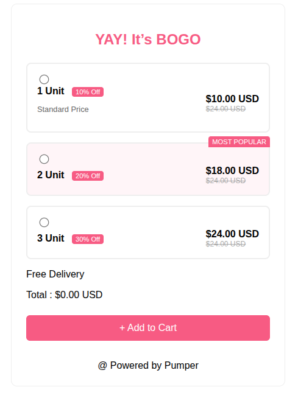

# 📦 BOGO Offer - Frontend Technical Support Task

This project is  layout built using **HTML, CSS, and vanilla JavaScript**, created for a **Frontend Technical Support** assignment.

## 🔥 Features

- 🎨 Responsive and mobile-friendly layout
- 📦 Interactive box selection with expand/collapse animation
- 🧠 Dynamic price calculation based on user selection
- 🏷️ Most Popular offer badge
- ✅ Clean, well-structured code

## 🖼️ Preview



## 🚀 Live Demo

- 🌐 Hosted Link: [View Live](https://interactive-boxes-task-theta.vercel.app/)
- 💻 Repository: [GitHub Repo](https://github.com/ravindra121q/interactive-boxes-task)

## 🛠️ Tech Stack

- **HTML5**
- **CSS3**
- **Vanilla JavaScript**

## 🧾 How to Use

1. **Clone the repository**

   ```bash
   git clone https://github.com/ravindra121q/interactive-boxes-task
   ```

2. **Navigate to the project folder**

   ```bash
   cd interactive-boxes-task
   ```

3. **Open the project**

   Simply open `index.html` in your browser.

## 📁 File Structure

```
/interactive-boxes-task
│
├── index.html       # Main HTML file
├── style.css        # All styles and transitions
├── script.js        # Radio logic and dynamic price
└── README.md        # Project documentation
```


## 📞 Contact

**Ravindra** - ravindra.dev07@gmail.com

📂 **Project Link:** [https://github.com/ravindra121q/interactive-boxes-task](https://github.com/ravindra121q/interactive-boxes-task)
